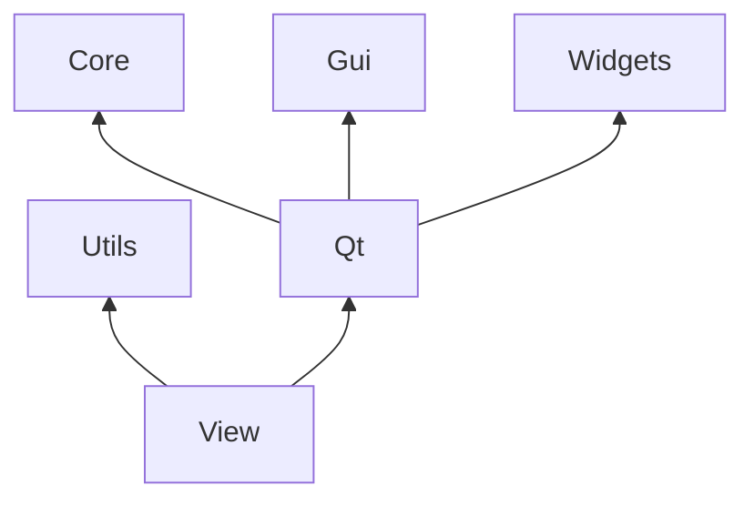

# View

Submodule for non specific Qt Widgets.

## Testing

The Test directory is setup to work with [googletest](https://github.com/google/googletest).

## Building


```sh
mkdir Build
cmake -S . -B Build -DView_BUILD_TEST=ON -DView_AUTO_RUN_TEST=ON
cmake --build Build
```

### Optional defines

| Option                  | Description                                          | Default |
| :---------------------- | :--------------------------------------------------- | :-----: |
| View_BUILD_TEST         | Build the unit test program.                         |   ON    |
| View_AUTO_RUN_TEST      | Automatically run the test program.                  |   OFF   |

# Dependencies 

### Dependencies

Local and external dependencies.


